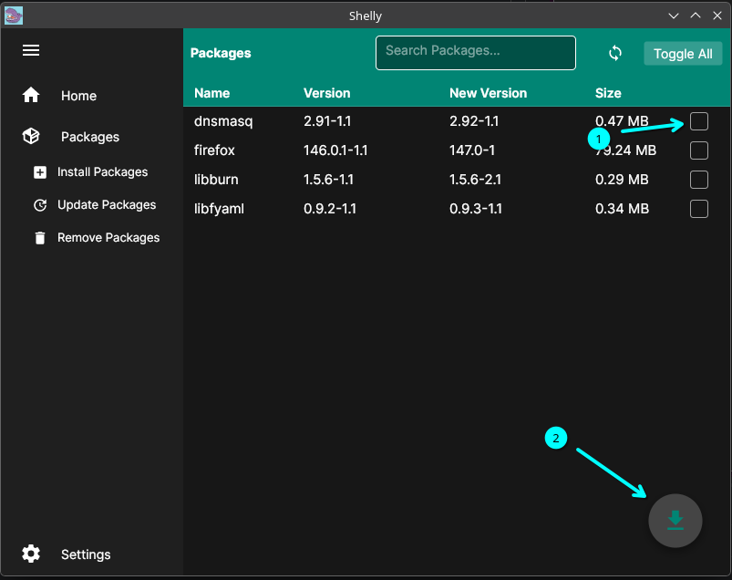

# What is Shelly?
Shelly is a visual package manager meant to make installing, updating, and removing packages simple.

# How to install Shelly!

Open the downloaded .tar.gz and open it in the terminal by navigating to its download location or opening it in a file explorer and opening it in your terminal of choice.

Run the following commands within the location extracted from the .tar.gz:

```bash
chmod +x install.sh
```

```bash
sudo bash install.sh 
```

Shelly should now be installed to your system, and you will be able to search for it like any other program.

# How to use Shelly!


### What is the home page?

The home page includes some key information, such as Arch news. This is important to take a look at to see if any special actions might be needed before updating. We only display the 10 most recent pieces of news, but if you ever need more or more detail, please check out https://archlinux.org/news/

### How to install packages:

To install a package, you will click on the package icon; this will drop down the menu, and you can click on Install Packages.


From here, you can search for any packages and install them by clicking on the checkbox and the download arrow on the bottom right.


You can right click on packages for more info such as said packages website.

### How to update packages:

Click on the update package icon to pull up the update page.


There are 2 ways to update packages: either by selecting the exact packages you want to update or by updating all.

To update only selected packages, check the box for the packages you want to select and click the update arrow at the bottom right.


Updating all can be handled by selecting "Toggle all," which will check all boxes, and then hitting the update arrow in the bottom right.


### How to remove packages:

Click on the remove package icon to pull up the remove page.


To remove a package, search for the packages you want to remove and select them (multiple can be selected at one time). Then, once you have selected all packages, you can remove them by clicking the trashcan icon in the bottom right.


